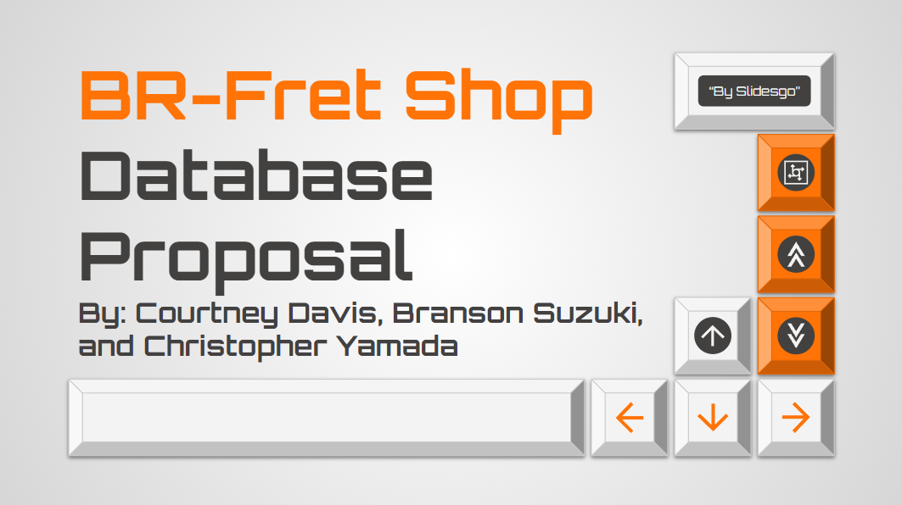

  

We proposed the implementation of a database system for a small, fretted instrument repair store located in Honolulu, Hawaii. This database will contain customer information such as name, city, phone, date, state, email, address, ZIP, and customer ID, as well as instrument, parts, and repair information. The implementation of this system will increase the efficiency of the business by reducing the amount of time digitizing and verifying customer transactions. This report will cover the requirements, design, and implementation of the database system.

Our database aims to address the needs of the business owners for BR Fret Shop. This database will assist in the documentation and processing of transactions between customers and employees. The proposed solution will improve the organization of business information. Currently the business relies on paper receipts as the primary method of record keeping which cannot be searched through a system. Incorporating a database system will improve the efficiency of the business while opening a road to scale up if needed in the future. Creating a database enables the business to send out digital receipts and automatically send out appointment reminders if requested. Receipts can be digitally verified through email as an alternative to a physical receipt pickup. Once the database appointment system is implemented an online appointment system can be added to reduce the number of calls taking away from the in-store customer experience. Customers will have multiple options to schedule pick up and drop off appointments from their web devices.

You can learn more by reading the full [BR Fret Shop Proposal](https://docs.google.com/document/d/1JJdWf4Se59_D3afjWOeoqDXElxR1whDqp3yTS_tiqbM/edit?usp=sharing).
