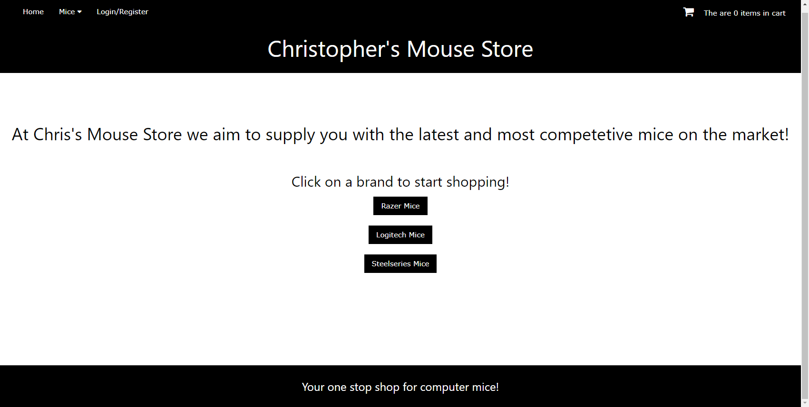

<div class="text-center p-4">
  
</div>

This project was a collaboration between me and my classmate Eden Tran. We worked together on the ITM353 final projects to create a test harness to test the functionality of my previously created mouse store. This project was a collaborative effort to test the limits of the functionality and see what gets by that should be invalid. Automatic tests are important to save on time when expanded to a large or medium scale project. This is because time is limited when working on a project.

The establishment of automatic testing eliminates the need for individual test cases on each page. Instead a standardized test can be created to test functionality. This saves precious time that can be spent on further capability expansion and project development. I learned how this can optimize the allocation of resources when working on time sensitive projects.


Here is some code that illustrates how automatic script functionality was used:

```cpp
function test(func, name, properties)
    {
        var test_name = name ? name : next_default_name();
        properties = properties ? properties : {};
        var test_obj = new Test(test_name, properties);
        test_obj.step(func);
        if (test_obj.status === test_obj.NOTRUN) {
            test_obj.done();
        }
    }

    function async_test(func, name, properties)
    {
        if (typeof func !== "function") {
            properties = name;
            name = func;
            func = null;
        }
        var test_name = name ? name : next_default_name();
        properties = properties ? properties : {};
        var test_obj = new Test(test_name, properties);
        if (func) {
            test_obj.step(func, test_obj, test_obj);
        }
        return test_obj;
    }

    function setup(func_or_properties, maybe_properties)
    {
        var func = null;
        var properties = {};
        if (arguments.length === 2) {
            func = func_or_properties;
            properties = maybe_properties;
        } else if (func_or_properties instanceof Function){
            func = func_or_properties;
        } else {
            properties = func_or_properties;
        }
        tests.setup(func, properties);
        output.setup(properties);
    }

```

You can find out more by visiting the [Test Harness Repo](https://github.com/citycoding/ITM353_S23_repo).
