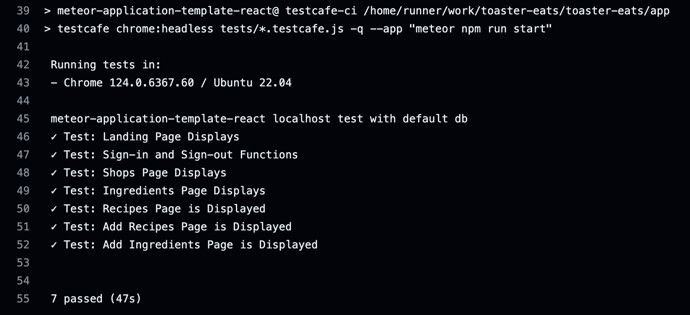

<div class="text-center p-4">
  
</div>

### Project Overview
This project was a collaboration between me and my classmates in ICS 314 to create a website called Toaster Eats. The goal of this project was to create a functional and practical web application for UH students to share recipes. Users are able to add recipes, search for recipes, find ingredients, and find stores for the ingredients. The project spanned a little over a month and took a collaborative effort from Toaster Eats group members to produce a fully functional website.

### Contribution & Experience
I had many learning opportunities with this project and played a very active role in developing the website. Some of my key contributions are creating our logo, creating the initial navigation bar, deploying to Digital Ocean, enabling HTTPS, adding a favicon, creating and setting up a custom domain name, and adding all continuous integration availability tests. During this journey, I learned how to effectively communicate with multiple team members on a collaborative coding project. Github is a Mavelopus tool that gives groups the ability to create and combine work in many different ways through branches and pull requests. These useful tools helped me contribute solutions to a large problem that we all tackled.

The system development life cycle and agile development encompass many aspects of software engineering that encompass inter-group communication, simulatious development, automatic testing, UI frameworks, coding standards, databases, and deployment. All of these concepts together create a chaotic environment in the real world that is much harder in practice than in planning. The rigorous yet fulfilling classroom experiences will give me the skills to handle new problems that require complex planning and execution.

<div class="text-center p-2">
  
</div>

Here is some code that illustrates how continuous integration availability tests were implemented:

```cpp

test('Test: Recipes Page is Displayed', async (testController) => {
  await navBar.gotoSignInPage(testController);
  await signinPage.signin(testController, credentials.username, credentials.password);
  await navBar.gotoRecipesPage(testController);
  await recipesPage.isDisplayed(testController);
});

test('Test: Add Recipes Page is Displayed', async (testController) => {
  await navBar.gotoSignInPage(testController);
  await signinPage.signin(testController, credentials.username, credentials.password);
  await navBar.gotoAddRecipesPage(testController);
  await addRecipesPage.isDisplayed(testController);
});

```

You can find out more by visiting the [Toaster Eats Organization](https://github.com/Toaster-Eats).
